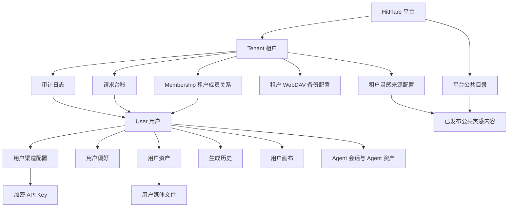

# HitFlare 多租户多用户、数据隔离与权限方案

状态：方案讨论稿  
更新时间：2026-09-14  
实施状态：尚未开发，本文件只用于收敛业务规则、数据边界、权限和接口合同。

## 0. 产品与技术架构复审结论

这次复审后，方案需要按“先把单部署内的多用户隔离做扎实，再保留多租户扩展点”的路线收敛。当前 HitFlare 已经有登录、管理员用户管理、服务端 Agent 会话存储，但资产库、生成历史、画布、渠道配置、WebDAV 同步仍大量依赖同一浏览器域下的本地存储。真正的问题不是菜单没有隐藏，而是业务数据没有以登录用户作为服务端权威归属。

### 0.1 产品定位复审

HitFlare 的产品身份应定义为：**独立账号的创作工作台**。模型平台或中转站只是用户自己的外部供应商配置，不是 HitFlare 的账号体系，也不是 HitFlare 的计费账户。

首版产品不做以下能力：

- 不做统一余额、充值、扣费、退款和供应商成本结算。
- 不做某一家中转站账号绑定登录。
- 不做管理员查看用户创作内容。
- 不做真正多租户运营后台，例如平台超级管理员、租户创建、跨租户报表和租户套餐。

首版必须做以下能力：

- 每个用户登录后看到自己的资产、生成历史、画布、渠道和偏好。
- 同一浏览器切换账号时，不能继续显示上一个账号的数据。
- 管理员可以建号、改角色、禁用、重置密码、查看登录时间和请求元数据。
- 普通用户可以自己配置 Base URL、API Key、模型和偏好。
- 管理员后台和系统配置不能成为读取用户内容的入口。

### 0.2 多租户边界复审

技术上仍建议所有业务表保留 `tenant_id`，但首版只落一个默认租户。

这样处理原因是：当前产品更像“一个部署服务一个团队或一个站点”，立即做完整多租户后台会把范围拉大，且用户当前最痛的是管理员和普通用户数据串读。首版用默认租户解决数据模型前瞻性，用用户隔离解决当前验收问题。

首版角色定义如下：

| 角色 | 产品含义 | 首版范围 |
| --- | --- | --- |
| 普通用户 | 使用 HitFlare 创作和管理自己的数据 | 只能访问自己的工作台数据 |
| 租户管理员 | 管理本部署或本租户下的账号和系统配置 | 不能查看用户内容 |
| 平台管理员 | 未来 SaaS 或多租户运营角色 | 首版不实现 |

当前代码里的 `users.role` 可以继续支撑首版。后续如果一个用户加入多个租户，再引入 `memberships.role`，不要把首版做成跨租户复杂权限系统。

### 0.3 数据架构复审

服务端应成为业务数据权威源，浏览器本地存储只能做缓存、草稿或离线过渡。

原因很直接：浏览器本地存储按“协议 + 域名 + 端口”隔离，不按 HitFlare 登录账号隔离。只改 IndexedDB key 可以缓解串读，但无法满足“换设备同步”“管理员请求日志”“禁用用户后阻断访问”“服务端备份恢复”等部署服务器版本能力。

首版建议按四类存储分层：

| 层 | 存什么 | 权威性 | 首版建议 |
| --- | --- | --- | --- |
| 身份库 | 用户、会话、角色、状态 | 权威 | 沿用当前 `hitflare.sqlite`，补默认租户字段 |
| 工作台元数据 | 渠道、偏好、资产记录、生成记录、画布项目 | 权威 | 新增服务端 store/API，查询必须带 `tenant_id + owner_user_id` |
| 媒体对象库 | 图片、视频、音频、附件 blob | 权威 | 服务端 `data/objects` 或 SQLite blob 二选一；大文件建议文件系统，DB 只存索引 |
| 浏览器缓存 | 临时预览、草稿、未上传队列 | 非权威 | key 带 `tenantId + userId`，登录切换时清空或重新加载 |

当前 Agent 服务端存储已经按 `user_id` 隔离，是其他业务域可以参考的样板：服务端接口先取当前 session 用户，再用用户 ID 查询和写入，不信任前端传来的归属。

### 0.4 API Key 架构复审

“服务端加密保存 API Key”和“浏览器直连模型 Base URL”可以同时成立，但产品表述必须准确。

实际链路应是：

```text
用户保存 Key → 服务端加密入库 → 用户打开工作台 → 前端拉取自己的渠道配置 → 发起模型请求时，当前用户浏览器短暂拿到自己的明文 Key → 浏览器直连用户配置的 Base URL
```

因此首版只能承诺：

- 数据库不保存明文 Key。
- 管理员接口不返回用户 Key。
- 页面只展示已保存或掩码。
- 日志不记录 Authorization Header。
- 用户自己浏览器运行时可以使用自己的 Key。

不能承诺：

- 用户本人无法在浏览器开发者工具看到自己的 Key。
- 平台能完全强制记录每一次模型调用。
- 管理员请求日志等同于供应商账单。

如果未来要求“浏览器运行时也不接触明文 Key”或“请求日志不可绕过”，必须把模型请求改为服务端代理。那会改变成本、并发、超时、流式响应、文件上传和错误处理架构，不属于当前首版。

### 0.5 请求日志和账单口径复审

在用户自带 API Key、浏览器直连模型平台的模式下，HitFlare 请求日志只能定位为**平台内操作台账**，不能定位为真实账单。

首版请求日志建议记录：

- `tenant_id`
- `user_id`
- `request_id`
- 业务类型：image / video / text / audio
- 渠道 ID、Base URL host、模型名
- 创建时间、完成时间、耗时、状态、错误码
- 输入摘要、提示词长度、提示词哈希
- 输出数量、媒体大小、客户端上报的供应商任务 ID

首版请求日志默认不记录：

- 完整 API Key
- Authorization Header
- 完整请求体
- 完整响应体
- 完整提示词
- 图片、视频、音频二进制内容

产品侧要把后台文案写成“请求日志”或“调用记录”，不要写成“账单”“扣费”“消费明细”。

### 0.6 WebDAV 产品矛盾复审

WebDAV 是当前方案里最容易混淆的点：如果 WebDAV 由管理员配置，并把用户图片、视频、画布内容以明文同步到管理员可访问的 WebDAV 目录，那么它事实上会给管理员提供绕过后台查看用户内容的能力。这和“管理员无权查看用户内容”冲突。

首版有三种路线，必须选一种：

| 路线 | 产品含义 | 优点 | 风险 |
| --- | --- | --- | --- |
| A. 暂停 WebDAV 用户内容同步 | WebDAV 只保留配置入口或只备份非内容元数据 | 最符合管理员不可见内容 | 跨设备备份能力延后 |
| B. 用户级 WebDAV | 每个用户自己配置自己的 WebDAV，同步自己的内容 | 权限最清晰 | 不符合“WebDAV 仅管理员操作”的直觉 |
| C. 管理员级加密备份 | 管理员配置备份目标，但用户内容文件以不可直接阅读的密文保存 | 兼顾集中备份和内容不可浏览 | 需要密钥体系、恢复流程和审计，复杂度最高 |

复审建议：首版采用 **A + C 的保守组合**。

- 管理员菜单里保留 WebDAV 作为系统备份能力。
- 首版不把用户明文内容通过旧的应用级 manifest 继续同步到 WebDAV。
- 如果要备份用户内容，只备份服务端对象库的密文或不可直接解释的对象，并记录 manifest、校验和、备份时间、对象数量。
- 恢复必须二次确认，恢复前先生成当前数据备份。
- 后台不提供“浏览用户备份内容”的功能。

如果产品更想要“用户跨设备同步自己的创作资产”，那应另开用户级同步，不应放在管理员 WebDAV 管理里。

### 0.7 菜单与权限架构复审

菜单权限只能做体验收敛，不能作为安全边界。首版权限应按五层实现：

```text
菜单可见性 → 路由守卫 → API 鉴权 → 查询条件 → 文件读取授权
```

管理员专属入口：

- 主导航最后的“用户管理”。
- 配置里的“灵感来源”。
- 配置里的“WebDAV”。
- 配置里的“本地存储”。
- 配置导入/导出、代理、脚本、插件等会影响整站或本机运行环境的高级能力。

普通用户可用入口：

- 首页。
- 生图。
- 视频。
- 我的资产。
- 创作灵感的浏览和使用。
- 画布。
- 配置里的渠道和用户偏好。

操作级规则：普通用户不是“按钮灰掉就可以”，而是直接 API 返回 403。管理员也不是“role=admin 就可以读所有内容”，读取资产、生成记录、画布、媒体对象时仍必须绑定资源所有者。

### 0.8 技术实施顺序复审

原方案的四阶段方向成立，但要把“服务端权威化”提前，避免继续在浏览器本地数据上叠权限。

复审后的实施顺序建议为：

1. **身份和权限底座**  
   固化默认租户、当前用户上下文、管理员 API 包装、统一 401/403、菜单与路由隐藏规则。

2. **渠道与偏好服务端化**  
   把 Base URL、模型列表、偏好迁到 `/api/me/config` 和 `/api/me/channels`；API Key 加密保存；前端只在当前用户会话下加载自己的配置。

3. **资产、生成历史、媒体对象服务端化**  
   把“我的资产”和图片/视频生成历史从浏览器共享 store 迁到服务端；媒体文件由服务端对象库托管，读取接口校验 `owner_user_id`。

4. **画布项目服务端化**  
   画布项目、节点、连接、附件和删除标记全部按用户保存；本地 IndexedDB 只作为缓存或未同步草稿。

5. **管理员系统能力收口**  
   用户管理、灵感来源、WebDAV、本地存储、请求日志分别接入 `/api/admin/*`，普通用户直接 403。

6. **迁移、审计和验收**  
   处理旧本地共享数据认领，补请求台账、审计日志、备份恢复策略和隔离验收用例。

不要先做大而全的租户后台，也不要先给现有 IndexedDB 数据加一层用户 key 就认为完成隔离。前者范围过大，后者不能满足部署服务器版本的同步和权限要求。

### 0.9 复审后的关键不确定项

以下事项在开发前需要定口径，否则实现会返工：

1. **WebDAV 首版路线**：采用保守的管理员级备份，还是改成用户级同步。
2. **管理员不可见内容的强度**：仅限制产品后台和 API，还是要求运维拿到数据库/备份文件也无法读内容。后者需要端到端或信封加密，复杂度明显上升。
3. **请求日志可信度**：接受浏览器直连下的客户端上报，还是要求所有模型请求必须经过服务端代理。
4. **旧本地数据处理**：默认绑定给首次登录管理员、提供一次性认领，还是直接清空旧共享数据。
5. **媒体存储形态**：首版用文件系统对象库，还是 SQLite blob。大图、视频和备份场景下更建议文件系统对象库。

复审结论：首版应锁定“默认租户 + 多用户强隔离 + 用户自带 Key + 浏览器直连模型 + 服务端保存用户业务数据 + 管理员只看账号和元数据”。这条路线可以解决当前共享数据问题，同时不把产品提前做成复杂 SaaS。

分工已收敛：我方只负责权限体系的前端入口、交互和规则说明；渠道、偏好、资产、生成历史、媒体对象、画布、请求日志、审计和备份恢复都属于后端服务端化范围。后端实现使用独立需求清单：[`BACKEND_ASSET_CANVAS_SERVICE_REQUIREMENTS.md`](BACKEND_ASSET_CANVAS_SERVICE_REQUIREMENTS.md)。

## 1. 方案目标

HitFlare 采用多租户、多用户模式。用户使用独立的 HitFlare 账号登录，模型平台或中转站账号只作为用户自己的外部服务配置，不作为 HitFlare 的身份来源。

方案要解决四个问题：

1. 管理员、普通用户和不同租户之间的数据不能互相串读。
2. 资产、生成历史、画布、渠道配置和 API Key 跟随用户账号，不跟随浏览器。
3. 灵感来源、WebDAV、本地存储等系统管理能力只对管理员开放。
4. 用户自带 API Key 时，HitFlare 不承担模型费用，只记录平台内的请求台账。

本方案的隔离要求必须同时在以下层面成立：

```text
菜单层 → 路由层 → API 层 → 数据查询层 → 文件存储层
```

隐藏菜单或禁用按钮不能代替服务端鉴权。

## 2. 已确认的业务模式

| 项目 | 已确认规则 |
| --- | --- |
| 平台身份 | 用户拥有独立 HitFlare 账号，不与某一家中转站账号绑定 |
| 建号方式 | 当前由管理员直接创建账号；暂不发送真实邮件邀请，也暂不开放用户自注册 |
| 登录标识 | 邮箱唯一且不区分大小写；用户名只用于用户侧展示，可修改 |
| 用户主键 | 使用不可变的用户 UUID；资产归属不能使用用户名或邮箱 |
| API Key 费用 | 模型费用由用户自己的中转站或模型平台承担 |
| HitFlare 账单 | 不做余额、充值、扣费、退款、供应商成本结算 |
| API Key 跨设备 | 是，同一用户在不同设备登录后可以使用自己已保存的配置 |
| API Key 存储 | 服务端加密保存，页面和管理员接口不返回完整明文 |
| 模型请求 | 当前继续由浏览器直连用户填写的 Base URL |
| 用户内容权限 | 管理员无权查看用户图片、视频、资产详情、画布、完整提示词和完整 API Key |
| 用户业务数据 | 资产、生成历史、画布、渠道和配置跟随用户账号 |
| 系统管理入口 | 灵感来源、WebDAV、本地存储仅管理员可管理 |

## 3. 必须保留的 API Key 安全边界

服务端加密保存与浏览器直连可以同时实现，但不能承诺浏览器运行时永远不会接触明文 Key。

采用以下边界：

- 数据库保存 AES-256-GCM 或同等级别的加密密文。
- 加密主密钥不进入数据库、不进入前端、不写入日志。
- 管理员、用户界面、导出文件和日志只显示“已保存”或掩码。
- 用户修改 Key 时覆盖旧密文；用户清除 Key 时删除密文。
- 浏览器发起直连模型请求时，运行时需要取得当前用户的明文 Key。
- 明文只应短暂存在当前用户浏览器内存或请求头中；用户本人仍可能通过浏览器开发者工具看到自己的请求。

如果未来要求服务器、管理员和用户浏览器运行时都不能接触明文，必须改为服务端代理模型请求，不能继续维持浏览器直连路线。

API Key 的归属建议同时绑定租户和用户：

```text
tenant_id + owner_user_id + channel_id
```

同一用户在同一租户内跨设备同步；用户加入其他租户时，默认使用另一套渠道和 Key。

## 4. 多租户、多用户关系模型

### 4.1 概念关系



### 4.2 身份、租户和归属

- `users.id` 是全局不可变 UUID。
- `tenants.id` 是租户不可变 UUID。
- `memberships` 表示用户属于哪个租户以及在该租户中的角色。
- 第一版可以限制一个用户只加入一个租户，但数据库从一开始保留 `memberships`，避免未来重做所有业务表。
- 当前 `admin` 语义定义为租户管理员，不代表跨所有租户的平台超级管理员。
- 后续如需平台级运营管理，再增加 `platform_admin`，不能把租户管理员直接升级为全局管理员。

每条用户私有业务数据至少包含：

```text
id
tenant_id
owner_user_id
created_at
updated_at
deleted_at（如采用软删除）
```

每一次查询的默认条件为：

```sql
WHERE tenant_id = :currentTenantId
  AND owner_user_id = :currentUserId
```

管理员可以管理账号和系统配置，但不能因为 `role = 'admin'` 就绕过 `owner_user_id` 读取用户内容。

## 5. 数据要素和归属字典

### 5.1 用户和租户基础数据

| 数据对象 | 关键字段 | 归属 | 普通用户 | 租户管理员 |
| --- | --- | --- | ---: | ---: |
| `tenants` | `id`, `name`, `status`, `created_at` | 租户 | 只读当前租户名称 | 管理本租户基础状态 |
| `users` | `id`, `email`, `username`, `role`, `status`, `last_login_at` | 用户/租户 | 只读自己 | 管理本租户基础账号资料 |
| `memberships` | `tenant_id`, `user_id`, `role`, `status` | 租户成员关系 | 不可管理 | 管理本租户成员 |
| `sessions` | `token_hash`, `user_id`, `expires_at` | 用户 | 服务端内部 | 不可查看 Token |
| `audit_logs` | `actor_user_id`, `tenant_id`, `action`, `target_type`, `target_id`, `created_at` | 租户审计 | 不可见 | 可查看管理操作记录 |

用户的业务名称、邮箱和显示名称都不能作为资源主键。用户名修改只影响展示，不改变任何历史归属。

### 5.2 用户私有数据

| 数据对象 | 关键字段 | 归属规则 |
| --- | --- | --- |
| `user_channels` | `id`, `tenant_id`, `owner_user_id`, `name`, `base_url`, `api_format`, `models`, `created_at`, `updated_at` | 只属于创建该渠道的用户 |
| `user_channel_secrets` | `channel_id`, `tenant_id`, `owner_user_id`, `ciphertext`, `key_version`, `updated_at` | 只保存加密密文，不返回明文 |
| `user_preferences` | `tenant_id`, `owner_user_id`, `image_model`, `video_model`, `text_model`, `audio_model`, 其他偏好 | 只属于当前用户 |
| `assets` | `id`, `tenant_id`, `owner_user_id`, `kind`, `title`, `metadata`, `storage_key` | 只属于当前用户 |
| `media_objects` | `id`, `tenant_id`, `owner_user_id`, `storage_key`, `mime`, `bytes`, `checksum` | 只允许资源所有者读取 |
| `generation_requests` | `id`, `tenant_id`, `owner_user_id`, `client_request_id`, `type`, `model`, `status`, `created_at` | 只属于发起请求的用户 |
| `generation_outputs` | `id`, `generation_id`, `asset_id`, `storage_key`, `metadata` | 继承生成请求和资产的用户归属 |
| `canvas_projects` | `id`, `tenant_id`, `owner_user_id`, `title`, `viewport`, `updated_at` | 只属于当前用户 |
| `canvas_revisions` | `id`, `project_id`, `tenant_id`, `owner_user_id`, `revision`, `document` | 只允许项目所有者读取 |
| `agent_threads` | `id`, `tenant_id`, `owner_user_id`, `revision`, `document` | 只允许会话所有者读取 |
| `agent_assets` | `id`, `thread_id`, `tenant_id`, `owner_user_id`, `storage_key` | 继承 Agent 会话所有者 |

普通用户只能查询自己的数据。管理员可看到与请求台账和审计相关的元数据，但不读取上述内容字段。

### 5.3 平台共享或租户管理数据

| 数据对象 | 归属 | 说明 |
| --- | --- | --- |
| `platform_prompt_sources` | 平台 | 内置灵感来源，由平台版本或平台管理员维护 |
| `tenant_prompt_sources` | 租户 | 租户管理员新增、编辑、启用和刷新 |
| `prompt_items` | 平台或租户 | 面向创作灵感页面发布的条目 |
| `prompt_source_fetch_status` | 平台或租户 | 抓取数量、最近成功时间和错误状态 |
| `tenant_webdav_configs` | 租户 | WebDAV 地址、目录和加密凭据 |
| `tenant_backup_manifests` | 租户 | 备份时间、范围、大小、校验结果，不直接展示内容 |
| `request_logs` | 租户 + 用户关联 | 只记录平台内请求遥测，不等同供应商财务账单 |

### 5.4 请求台账，不称为供应商账单

用户自带 API Key 且浏览器直连中转站时，HitFlare 无法知道用户在平台外发起的请求，也无法知道中转站实际扣费、折扣或供应商成本。

平台只记录：

```text
request_id
tenant_id
user_id
client_request_id
请求类型
模型名称
渠道名称或 Base URL 主机名
开始时间
完成时间
耗时
started / success / failed / cancelled / interrupted
生成数量
输出文件大小
供应商 request_id（如有）
错误类型
提示词摘要、长度或哈希（按最终保留策略）
```

默认不记录：

```text
API Key
Authorization Header
完整请求体
完整响应体
完整媒体内容
```

完整提示词保存在用户自己的生成历史中。管理员请求台账默认只看到摘要、长度和哈希。

## 6. 菜单级权限清单

### 6.1 主导航

| 菜单 | 普通用户 | 租户管理员 | 说明 |
| --- | ---: | ---: | --- |
| 首页 | 可见 | 可见 | 公共灵感内容与个人状态 |
| 生图 | 可见 | 可见 | 使用当前用户自己的渠道 |
| 视频 | 可见 | 可见 | 使用当前用户自己的渠道 |
| 我的资产 | 可见 | 可见 | 仅当前用户资产 |
| 创作灵感 | 可见 | 可见 | 读取已发布灵感内容 |
| 画布 | 可见 | 可见 | 仅当前用户画布 |
| 配置管理 | 可见 | 可见 | 子 Tab 按下表控制 |
| 用户管理 | 不显示 | 可见 | 仅本租户账号管理 |

### 6.2 配置管理子菜单

| 配置 Tab | 普通用户 | 租户管理员 | 说明 |
| --- | ---: | ---: | --- |
| 渠道 | 可见、可编辑自己的 | 可见、可编辑自己的 | API Key 和 Base URL 是用户私有配置 |
| 默认偏好 | 可见、可编辑自己的 | 可见、可编辑自己的 | 模型和生成偏好 |
| 本地代理 | 不可见 | 可见、可管理 | 本机代理属于运行配置 |
| 灵感来源 | 不可见 | 可见、可管理 | 来源维护和刷新 |
| WebDAV | 不可见 | 可见、可管理 | 租户备份和恢复 |
| 本地存储 | 不可见 | 可见、可管理 | 当前设备存储诊断和迁移 |

普通用户不得通过以下方式绕过菜单权限：

```text
/config?tab=prompt-sources
/config?tab=webdav
/config?tab=local-storage
直接访问管理路由
直接调用管理 API
修改前端状态或请求体
```

处理规则：

- 菜单不显示。
- 直接访问受保护页面返回 `403` 或重定向到可访问页面。
- 受保护 API 返回 `403`。
- 仅有查看公共灵感内容的页面不等于有来源管理权限。

## 7. 数据级和操作级权限清单

### 7.1 用户管理

| 操作 | 普通用户 | 租户管理员 |
| --- | ---: | ---: |
| 查看自己的账号资料 | 允许 | 允许 |
| 查看本租户用户列表 | 禁止 | 允许 |
| 新建用户 | 禁止 | 允许 |
| 编辑显示名称和角色 | 禁止 | 允许 |
| 修改邮箱 | 禁止 | 允许，仍需唯一校验 |
| 修改用户 UUID | 禁止 | 永久禁止 |
| 启用 / 禁用账号 | 禁止 | 允许 |
| 重置用户密码 | 禁止 | 允许 |
| 查看用户完整 API Key | 永久禁止 | 永久禁止 |
| 查看用户图片、视频、画布和完整提示词 | 永久禁止 | 永久禁止 |
| 查看用户最后登录时间 | 仅自己 | 允许看本租户账号 |

### 7.2 用户私有工作台

| 操作 | 普通用户 | 租户管理员对其他用户 |
| --- | ---: | ---: |
| 创建、修改、删除自己的渠道 | 允许 | 不适用，不能代操作 |
| 保存、修改、清除自己的 API Key | 允许 | 不可查看或代取明文 |
| 查看自己的资产和媒体 | 允许 | 禁止 |
| 下载自己的资产 | 允许 | 禁止 |
| 查看自己的生成历史 | 允许 | 禁止 |
| 删除自己的历史记录 | 按产品开关允许 | 禁止代删 |
| 查看、编辑、删除自己的画布 | 允许 | 禁止 |
| 使用自己的 Agent 会话 | 允许 | 禁止查看他人会话 |
| 查看其他用户资源 | 禁止 | 禁止 |
| 猜测资源 ID 读取数据 | 必须返回 `404` 或统一拒绝 | 必须返回 `404` 或统一拒绝 |

### 7.3 灵感来源

| 操作 | 普通用户 | 租户管理员 |
| --- | ---: | ---: |
| 进入灵感来源管理页 | 禁止 | 允许 |
| 读取已发布灵感条目 | 允许，通过创作灵感页 | 允许 |
| 查看来源地址、抓取状态和错误 | 禁止 | 允许 |
| 新建自定义来源 | 禁止 | 允许 |
| 编辑自定义来源 | 禁止 | 允许 |
| 删除自定义来源 | 禁止 | 允许 |
| 启用 / 禁用来源 | 禁止 | 允许 |
| 刷新单个来源 | 禁止 | 允许 |
| 刷新全部来源 | 禁止 | 允许 |
| 修改刷新周期 | 禁止 | 允许 |
| 修改平台内置来源 | 禁止 | 后续平台管理员允许 |

建议数据拆分：

```text
platform_prompt_sources     平台内置来源
tenant_prompt_sources       租户自定义来源
prompt_items                对用户发布的灵感条目
prompt_source_fetch_status  抓取状态
```

普通用户只得到已发布的 `prompt_items`，不得到来源 URL、刷新任务、缓存文件或管理配置。

### 7.4 WebDAV

| 操作 | 普通用户 | 租户管理员 |
| --- | ---: | ---: |
| 进入 WebDAV 配置页 | 禁止 | 允许 |
| 查看地址、远程目录和账号 | 禁止 | 允许 |
| 查看密码明文 | 禁止 | 禁止，只显示已配置 |
| 修改连接配置 | 禁止 | 允许 |
| 测试连接 | 禁止 | 允许 |
| 发起租户备份 | 禁止 | 允许 |
| 发起租户恢复 | 禁止 | 待确认；建议二次确认后允许 |
| 查看同步进度、数量和校验结果 | 禁止 | 允许 |
| 在线浏览用户图片、画布和完整提示词 | 禁止 | 禁止 |
| 导出 API Key 明文 | 禁止 | 禁止 |

首版建议把 WebDAV 定义为**租户管理员发起的备份能力**。如果开放恢复，必须：

- 二次确认恢复范围和覆盖行为；
- 写入审计日志；
- 先生成当前数据备份；
- 恢复失败时不得覆盖原数据；
- 不提供按用户浏览内容的管理界面。

### 7.5 本地存储

| 操作 | 普通用户 | 租户管理员 |
| --- | ---: | ---: |
| 进入本地存储管理页 | 禁止 | 允许 |
| 查看当前设备容量、配额和占用 | 禁止 | 允许 |
| 查看 IndexedDB 数据库和对象仓记录数 | 禁止 | 允许 |
| 查看图片、视频、提示词内容 | 禁止 | 禁止 |
| 执行旧数据归属迁移 | 禁止 | 允许 |
| 导出迁移包 | 禁止 | 允许，敏感字段必须加密或剔除 |
| 清理未归属旧数据 | 禁止 | 允许，必须二次确认和审计 |
| 清理缓存 | 后续可提供“清理自己的缓存” | 允许 |
| 修改全局存储策略 | 禁止 | 仅平台管理员或部署运维允许 |

本地存储统计是“当前浏览器设备的诊断信息”，不是租户的服务端存储统计。管理员可看容量和记录数量，但不能通过此页面读取用户内容。

## 8. 本地缓存、服务端文件和 WebDAV 存储规则

### 8.1 当前问题

现有工作台部分数据仍使用固定的浏览器 IndexedDB/localForage 名称：

```text
infinite-canvas:ai_config_store
infinite-canvas:asset_store
infinite-canvas:canvas_store
infinite-canvas:image_generation_logs
infinite-canvas:video_generation_logs
image_files
media_files
```

浏览器本地存储按“协议 + 域名 + 端口”隔离，不按登录账号隔离。因此同一浏览器切换管理员和普通用户时，会读取同一份旧数据。

### 8.2 目标缓存键

本地 IndexedDB 只作为当前用户缓存，不再作为业务事实来源。缓存命名必须包含租户和用户 UUID：

```text
hitflare:{tenantId}:{userId}:config
hitflare:{tenantId}:{userId}:assets
hitflare:{tenantId}:{userId}:canvas
hitflare:{tenantId}:{userId}:image-history
hitflare:{tenantId}:{userId}:video-history
hitflare:{tenantId}:{userId}:media
```

只含界面偏好的极小字段才可以继续使用 `localStorage`。业务列表、媒体、生成记录和大 JSON 不使用 `localStorage`。

### 8.3 服务端文件键

服务端媒体路径建议：

```text
tenant/{tenantId}/user/{userId}/assets/{assetId}/original
tenant/{tenantId}/user/{userId}/assets/{assetId}/cover
tenant/{tenantId}/user/{userId}/generations/{generationId}/{outputId}
tenant/{tenantId}/user/{userId}/canvas/{projectId}/attachments/{fileId}
tenant/{tenantId}/user/{userId}/agent/{threadId}/{assetId}
```

对象读取不能只根据路径或前端传入的 `userId` 判断，服务端必须先根据会话查询资源归属。

### 8.4 WebDAV 路径

WebDAV 不能继续使用一个所有用户共用的应用级 manifest。建议：

```text
/tenant/{tenantId}/
    backup-manifest.json
    users/{userId}/
        config/
        assets/
        generations/
        canvases/
        media/
```

WebDAV 备份记录应包含：

```text
tenant_id
backup_id
created_at
scope
file_count
bytes
checksum
schema_version
```

管理员只能发起备份、查看元数据和恢复，不在管理后台浏览用户内容。

## 9. 服务端接口合同

### 9.1 通用规则

1. 当前用户从 HttpOnly 会话 Cookie 取得，不能信任请求体、查询参数或隐藏字段里的 `userId`。
2. 当前租户从会话或服务端选定的 membership 取得，不能由前端任意切换。
3. 所有资源查询同时校验 `tenant_id` 和 `owner_user_id`。
4. 资源不属于当前用户时，读取、更新、删除和下载统一返回 `404` 或不泄露存在性的拒绝结果。
5. 写入接口支持 `clientRequestId` 或幂等键，避免重复生成记录。
6. 管理接口必须有管理员角色判断；菜单和路由限制不能代替 API 鉴权。
7. 业务写入、媒体索引和请求台账需要在可恢复的事务边界内完成。

### 9.2 用户私有接口

```text
GET/PUT      /api/me/config
GET/POST     /api/me/channels
PATCH/DELETE /api/me/channels/:channelId
POST         /api/me/channels/:channelId/secret
DELETE       /api/me/channels/:channelId/secret

GET/POST     /api/me/assets
PATCH/DELETE /api/me/assets/:assetId
GET          /api/me/assets/:assetId/content

GET          /api/me/generations
GET          /api/me/generations/:generationId
DELETE       /api/me/generations/:generationId

GET/POST     /api/me/canvases
GET/PATCH/DELETE /api/me/canvases/:projectId
GET          /api/me/canvases/:projectId/revisions

POST         /api/me/request-logs/start
PATCH        /api/me/request-logs/:requestId
GET          /api/me/request-logs
```

### 9.3 管理接口

```text
GET/POST     /api/admin/users
PATCH        /api/admin/users/:userId
PATCH        /api/admin/users/:userId/status
POST         /api/admin/users/:userId/password

GET/POST     /api/admin/prompt-sources
PATCH/DELETE /api/admin/prompt-sources/:sourceId
POST         /api/admin/prompt-sources/:sourceId/refresh
POST         /api/admin/prompt-sources/refresh-all
GET          /api/admin/prompt-sources/status

GET/PUT      /api/admin/webdav/config
POST         /api/admin/webdav/test
POST         /api/admin/webdav/backup
POST         /api/admin/webdav/restore
GET          /api/admin/webdav/backups

GET          /api/admin/local-storage/summary
POST         /api/admin/local-storage/claim-legacy
POST         /api/admin/local-storage/export
POST         /api/admin/local-storage/cleanup-orphans

GET          /api/admin/request-logs
GET          /api/admin/audit-logs
```

### 9.4 浏览器直连模型的请求记录流程

```text
1. 浏览器使用当前会话创建 request_log。
2. 服务端从会话写入 tenant_id、user_id 和 request_id。
3. 浏览器取得当前用户运行时配置，直连用户 Base URL。
4. 浏览器回传 success、failed、cancelled 或 interrupted。
5. 服务端保存生成记录、输出索引和当前用户资产归属。
6. 服务端完成 request_log；超时或关闭页面的请求由过期任务标记为 interrupted。
```

需要防止浏览器重复回报同一请求，使用：

```text
clientRequestId + user_id + tenant_id
```

请求台账是 HitFlare 平台内的遥测记录，不是中转站真实扣费账单。

## 10. 登录、切换账号和数据加载顺序

登录成功后，前端必须按以下顺序建立用户空间：

```text
1. 获取当前用户和可用租户 membership。
2. 确定 activeTenantId。
3. 拉取该用户配置和渠道摘要。
4. 拉取该用户资产索引。
5. 拉取图片、视频生成历史。
6. 拉取该用户画布和版本。
7. 拉取该用户 Agent 会话。
8. 完成归属确认后再显示工作台。
```

切换账号或租户时必须：

- 终止旧用户未完成请求；
- 停止旧 Agent 事件流；
- 清空旧用户内存状态；
- 释放旧媒体 Blob URL；
- 卸载旧用户插件和临时订阅；
- 阻止旧请求向新用户空间写入；
- 重新加载新用户、新租户数据；
- 校验缓存键中的 `tenantId` 和 `userId`。

API Key 页面只显示：

```text
未配置：配置 API Key
已配置：API Key 已保存
操作：修改 / 清除
```

不提供“查看完整 Key”按钮。

## 11. 现有共享本地数据的定义和迁移

“现有共享本地数据”指当前版本已经写入浏览器，但没有明确 `tenant_id` 和 `owner_user_id` 的数据，包括：

- 渠道、Base URL、API Key 和模型偏好；
- 资产元数据、缩略图和媒体 Blob；
- 图片和视频生成历史；
- 画布项目、节点和版本；
- Agent 之外的本地工作台状态；
- WebDAV 应用级同步清单和缓存。

它不是新的共享业务范围，而是需要被收敛和迁移的历史数据。

推荐迁移规则：

1. 服务端新模型上线前先备份原始浏览器导出包。
2. 当前管理员首次登录时显示一次“认领现有本地数据”。
3. 管理员确认后，将可识别的旧数据绑定到管理员的 `tenant_id + user_id`。
4. 普通用户首次登录进入空的用户空间。
5. 普通用户通过导入包导入自己拥有的旧资产。
6. 无法确认归属的数据放入待处理或隔离区，不能自动复制给所有用户。
7. 迁移失败时保留原始导出包，不覆盖原数据。
8. 迁移完成后旧固定存储键只读或标记为 legacy，不能继续写入。

## 12. 四个实施阶段

### 阶段一：归属、安全和接口合同

目标：冻结规则，不切换页面。

交付物：

- 租户、用户、membership 和角色定义；
- 数据字典和归属字段；
- 菜单、路由、API、数据级权限矩阵；
- API Key 加密、掩码和运行时取用协议；
- 请求台账字段和脱敏规则；
- 删除、备份、恢复、审计和保留策略；
- 旧本地数据迁移规则。

阶段门槛：所有“管理员是否能看内容”“WebDAV 是否恢复”“请求日志保存什么”之类会改变结构的事项必须有结论或明确采用默认建议。

### 阶段二：服务端用户数据层

目标：服务端成为业务事实来源。

建议新增或调整：

```text
tenants
memberships
user_channels
user_channel_secrets
user_preferences
assets
media_objects
generation_requests
generation_outputs
canvas_projects
canvas_revisions
request_logs
audit_logs
tenant_prompt_sources
tenant_webdav_configs
tenant_backup_manifests
```

交付要求：

- 所有用户资源使用 UUID；
- 所有查询从会话推导用户和租户；
- 所有媒体读取先校验资源归属；
- API Key 加密密文不出现在普通 API 响应；
- 管理员内容接口不存在或统一返回禁止；
- 关键写操作写入审计日志；
- 生成请求支持幂等。

### 阶段三：前端切换到服务端优先

目标：浏览器 IndexedDB 只做用户缓存，不做共享事实源。

交付要求：

- 登录后按用户和租户加载数据；
- 配置、资产、历史和画布从服务端读取；
- 本地缓存键带 `tenantId + userId`；
- 账号切换清空旧内存状态和媒体 URL；
- 普通用户隐藏灵感来源、WebDAV、本地存储菜单；
- 普通用户直接访问受保护 Tab 或路由失败；
- 管理员也不能调用用户内容读取接口；
- 生成成功后先写服务端归属，再更新本地缓存。

### 阶段四：迁移、部署和隔离验收

目标：在本地和部署环境证明隔离成立。

交付要求：

- 先备份数据库和媒体目录；
- 迁移旧浏览器数据并记录结果；
- 验证应用入口仍使用 `http://localhost:3000/`，内部 API 端口不作为用户入口；
- 验证服务端健康检查和登录链路；
- 验证普通用户、管理员、两个普通用户和两个租户的隔离；
- 记录版本、数据库 schema 版本、迁移包校验值和回滚点。

## 13. 待最终确认的方案项

以下事项仍会影响实现细节，建议采用右侧默认值：

| 待确认项 | 建议默认值 | 影响 |
| --- | --- | --- |
| 当前管理员的作用域 | 租户管理员；平台管理员后续再加 | 影响角色、接口和后台范围 |
| 一个用户是否可加入多个租户 | 第一版一个 membership，表结构支持多 membership | 影响租户切换和配置选择 |
| WebDAV 是否开放恢复 | 首版备份优先；恢复需二次确认和预备份 | 影响覆盖、回滚和审计 |
| 管理员无权查看内容的边界 | 先保证产品/API/数据库查询层；运维人员可见性另行做密钥体系 | 影响端到端加密和恢复能力 |
| 请求日志保存完整提示词吗 | 不保存，只存摘要、长度和哈希 | 影响隐私和排障能力 |
| 请求日志保留周期 | 配置化，首版建议 90 天 | 影响清理任务和存储量 |
| 用户删除策略 | 先支持禁用；删除采用软删除和审计 | 影响恢复与合规 |
| 多设备配置冲突 | 最后写入生效 | 影响版本号和冲突提示 |
| 画布冲突策略 | 版本冲突提示并允许生成副本 | 影响协作恢复 |
| 服务端媒体存储 | 首版持久磁盘或 Docker volume，接口预留 S3/MinIO | 影响部署和扩容 |
| 用户存储和请求限制 | 先配置化预留，具体数值另定 | 改变行为边界，需单独确认 |

本表中的“建议默认值”只有在用户确认后才进入开发合同。未确认的数值不能静默写入实现。

## 14. 隔离验收清单

### 菜单、路由和 API

- [ ] 普通用户看不到“灵感来源、WebDAV、本地存储”入口。
- [ ] 普通用户直接打开受保护 Tab、路由或接口得到拒绝。
- [ ] 普通用户不能通过修改前端状态绕过权限。
- [ ] 管理员用户管理入口只对管理员显示。

### 用户数据

- [ ] 管理员资产普通用户查不到。
- [ ] 普通用户 A 的资产、历史、画布和渠道普通用户 B 查不到。
- [ ] 不同租户的同名用户数据互不可见。
- [ ] 猜测其他用户资源 ID 不能读取。
- [ ] 两台设备登录同一账号可以读取同一份服务端数据。
- [ ] 同一浏览器切换账号后不残留旧用户数据。
- [ ] 删除或禁用 A 不影响 B。

### API Key 和隐私

- [ ] API Key 跨设备同步。
- [ ] 数据库只保存加密密文。
- [ ] 页面不显示完整 Key。
- [ ] 管理员接口不返回完整 Key。
- [ ] 请求日志、审计日志和导出包不包含明文 Key。
- [ ] 明确记录浏览器直连模式下用户本人可能在开发者工具看到运行时请求。

### 灵感来源、WebDAV、本地存储

- [ ] 普通用户只能读取已发布灵感条目，不能管理来源。
- [ ] 灵感来源配置按平台和租户拆分。
- [ ] WebDAV 按租户和用户路径隔离，不再共用应用级 manifest。
- [ ] WebDAV 备份不提供管理员在线浏览用户内容。
- [ ] 本地存储页面展示的是当前设备诊断，不被当作租户业务数据。
- [ ] 旧本地数据迁移前有原始备份。
- [ ] 无法确认归属的数据不会自动复制给所有用户。

### 请求台账和审计

- [ ] 管理员能看到请求时间、用户、模型、状态、耗时等元数据。
- [ ] 管理员不能通过请求台账查看完整提示词和媒体内容。
- [ ] 重复回报不会生成重复请求记录。
- [ ] 用户管理、备份、恢复、清理和迁移操作写入审计日志。

## 15. 当前实现与目标差距

当前已经具备：

- SQLite 用户表、用户 UUID、唯一邮箱、角色、状态和最后登录时间；
- HttpOnly 会话 Cookie；
- 管理员建号、编辑、启用/禁用和重置密码；
- 管理员路由和部分管理员操作保护；
- Agent 会话和 Agent 资产的服务端用户隔离。

当前尚未完整具备：

- 渠道、API Key、偏好、资产、生成历史和画布的服务端用户数据层；
- 按租户和用户分区的服务端媒体存储；
- 普通用户对“灵感来源、WebDAV、本地存储”的菜单、路由和 API 三级隔离；
- WebDAV 的租户/用户目录和清单隔离；
- 旧浏览器共享数据的认领和迁移流程；
- 请求台账、脱敏、幂等和管理员元数据查询接口。

现有账号和 Agent 代码位置主要包括：

```text
server/auth.mjs
server/agent/store.mjs
server/agent/routes.mjs
web/src/stores/use-user-store.ts
web/src/lib/permissions.ts
web/src/components/layout/app-config-modal.tsx
web/src/components/layout/config-prompt-sources.tsx
web/src/components/layout/config-local-storage.tsx
web/src/services/app-sync.ts
```

本文件完成后仍处于方案阶段。只有收到明确的“按方案开始开发 / 继续开发”指令，才进入数据库、接口、前端缓存迁移和部署工作。
