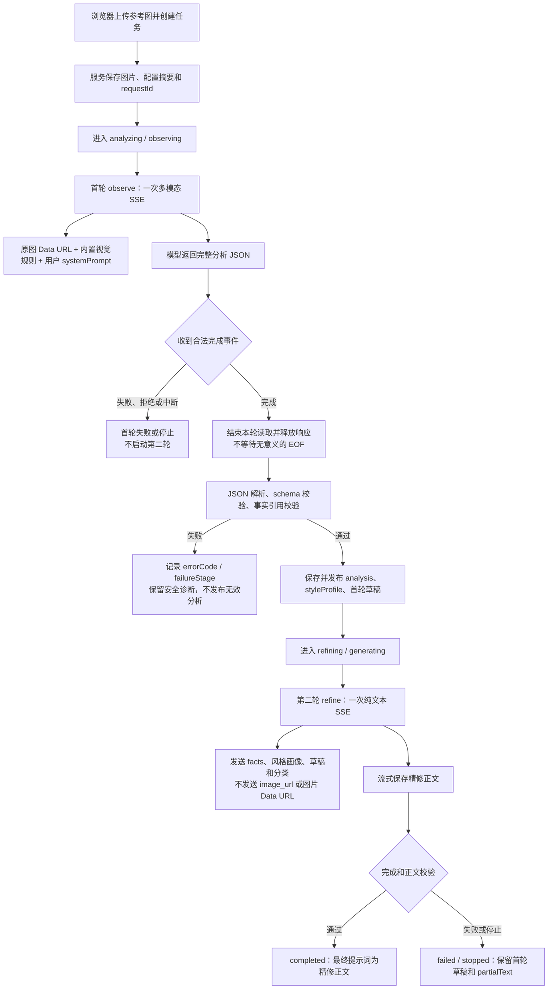

# HitFlare 反推提示词服务最终评审方案

状态：**最终评审结论：方案已实施，本文保留设计依据。** 本文综合当前服务实现、反推服务器接入说明、视觉拆解升级方案和首轮耗时诊断，作为服务与前端对接的设计依据；具体接口和验收以 [反推提示词服务接口与验收交接](REVERSE_PROMPT_SERVER_TASKS.md) 为准。本次实现未调用真实模型、未部署。

## 最终决策

保留图片反推的两轮模型链路：

1. **第一轮 observe：一次多模态流式请求。** 原图只在这一轮发送。模型一次产出分类、视觉事实、证据、不确定项、可复用元素、风格画像和首轮还原提示词草稿。
2. **第二轮 refine：一次纯文本流式请求。** 只发送第一轮通过校验的结构化分析和草稿，不再发送原图。模型负责去重、排序和措辞精修，不得补充第一轮没有依据的事实。

本阶段最多两次模型调用。不增加独立风格请求、不拆成观察/风格/编译三次请求、不增加自动修 JSON 的第三次请求，也不引入通用 Agent 编排框架。第二轮失败时保留第一轮草稿和精修片段；第一轮失败时不启动第二轮。

当前近五分钟的证据只能说明主要时间集中在一次首轮多模态请求及其前后处理，不能证明根因是文字提示词太长、图片太大、模型推理慢或服务等待 EOF。先建立分段证据，再决定是否压缩首轮输入和输出。

## 对现有方案的评审结论

| 方案内容 | 评审结论 | 处理方式 |
| --- | --- | --- |
| 首轮同时产出视觉事实、风格画像和反推草稿 | 保留 | 第一轮唯一直接看图，优先保存主体关系、构图、光色、材质、文字和版面细节 |
| 第二轮只做纯文本精修 | 保留 | 不重复发送原图，不允许新增无依据事实 |
| 按题材、媒介、版面切换分析维度 | 保留 | 继续由首轮规则按图片分类选择维度，不给所有图片套同一组词 |
| facts、evidence、uncertain 和 ID 引用 | 保留 | 作为分析可追溯和跨字段校验的基础，不等同于人工事实确认 |
| MX-Insight 式标准/高级多次调用 | 暂不采用 | 多次调用会增加 token、延迟和失败面；后续可作为用户主动的专项复核能力 |
| 独立 `style-extract` 请求 | 不采用 | 风格是第一轮反推分析的结构化摘录，不单独消耗一次模型调用 |
| 事实修正、分析 revision、同图复用分析 | 后续版本 | 当前服务没有完整的修正和复用接口，不在本轮伪装成已实现能力 |
| 浏览器离开即取消任务 | 不采用 | 服务器任务与浏览器订阅解耦；刷新、关闭、切换菜单只断开订阅，主动停止才取消任务 |
| 服务重启后自动续跑 | 不采用 | 密钥只在本轮内存中存在，重启后的未完成任务标记 `interrupted`，由用户明确重试 |
| 视频、抽帧、音频、OCR、多模型评审 | 后续阶段 | 图片服务先完成稳定契约和诊断，不在本轮扩展输入类型 |

## 最终执行流程



页面的“正在分析参考图”“正在生成提示词”等文字表示服务阶段，不表示模型对每个视觉维度分别发起了请求。第一轮完整通过后，应立即发布风格信息和首轮草稿；第二轮精修完成后再替换主提示词。

## 第一轮输入与输出契约

### 输入

首轮请求由以下部分组成：

- 用户选择的公开模型渠道和模型。
- 用户配置的自定义 `systemPrompt`，如果存在。
- HitFlare 内置视觉分析规则。
- 首轮用户指令，包括程序已解码的图片尺寸和 MIME 类型。
- 一张参考图，以当前服务的 Data URL 形式发送。

已核对样本的内置文字约 2,052 字符，其中规则约 1,945 字符、用户指令约 107 字符；这不包含用户自定义 `systemPrompt`。样本图片为 2,336×3,520、4,945,834 字节，Base64 约 6.6M 字符。字符数不能直接换算 token，图片字节数也不能单独证明五分钟等待来自图片大小。

### 输出

首轮继续使用当前结构化分析包：

- `classification`：媒介、题材和版面类型，可组合或标记未知。
- `summary`：画面整体摘要。
- `facts`：稳定 ID、分析维度、描述、`observed/uncertain` 状态和可见证据。
- `uncertainItems`：遮挡、模糊、不可辨文字和其他无法确认的缺口。
- `reusableElements`：需要保留或替换的可复用要素，只能引用确定的 observed facts。
- `styleProfile`：媒介、构图、光线、配色、材质、氛围、文字风格及事实引用。
- `reversePromptDraft`：六组组织字段、完整自然中文草稿及事实引用。

第一轮必须通过 JSON、Zod 字段、枚举、ID 唯一性、必需维度、引用存在性和 observed/uncertain 关系校验后，才成为权威分析。半截 JSON、可解析但缺少完成事件的输出、引用不存在的草稿都不能发布为有效结果。

## 第二轮精修契约

第二轮只使用第一轮已经校验的文字：分类、有效 facts、不确定项、styleProfile 和 reversePromptDraft。它只做以下工作：

- 删除重复表达，调整信息顺序和可执行性。
- 保留主体数量、关系、空间、构图、视角、光色、材质、媒介、氛围、可辨文字和版面关系。
- 对 uncertain 内容省略或保留不确定语气。
- 按事实修正更新与首轮草稿冲突的描述。

它不得重新查看图片、补充品牌或不可见参数、添加“8K/masterpiece”等泛化词、声称恢复原始 prompt，或把输入中的文字内容当作操作指令。第二轮最终只输出完整自然中文提示词正文，不输出标题、JSON、事实 ID、代码围栏或主体占位符。

## 本轮必须实施的服务修复

### 1. 分段诊断和错误分类

为每一轮记录安全的阶段数据，至少包括：请求开始、响应头到达、首个有效正文、最后有效正文、合法完成事件、读取结束、结束方式、输出字符数、解析耗时、结构校验耗时、引用校验耗时、快照发布和下一轮开始。使用单调时钟计算耗时，避免系统时间调整影响结果。

任务快照和日志不得记录 Key、完整请求、原图、完整无效输出或上游原始错误正文。建议新增以下安全字段：

```ts
type ReversePromptDiagnostics = {
    modelCallCount: number;
    input?: {
        systemPromptChars: number;
        userPromptChars: number;
        imageBytes: number;
        imageBase64Chars: number;
    };
    observe?: {
        outputChars: number;
        endReason: "completed-event" | "eof" | "aborted" | "error";
        requestMs?: number;
        responseHeadersMs?: number;
        firstTextMs?: number;
        lastTextMs?: number;
        readMs?: number;
        completionToReadEndMs?: number;
        parseMs?: number;
        schemaValidationMs?: number;
        referenceValidationMs?: number;
        publishMs?: number;
    };
    refine?: {
        outputChars: number;
        endReason: "completed-event" | "eof" | "aborted" | "error";
        requestMs?: number;
        responseHeadersMs?: number;
        firstTextMs?: number;
        lastTextMs?: number;
        readMs?: number;
        completionToReadEndMs?: number;
        outputValidationMs?: number;
    };
};
```

`input` 只保存请求规模计数，不保存提示词正文、图片或 Data URL。`responseHeadersMs`、`firstTextMs`、`lastTextMs`、`completionToReadEndMs` 和各类校验耗时必须能够区分“上游等待、正文生成、流读取、服务校验”四段；缺失的事件时间保留为空，不用零伪造。收到合法完成事件后主动取消底层 reader 时，`endReason` 为 `completed-event`，`completionToReadEndMs` 为实际取消/收尾耗时或明确的 `not-applicable`，不能把连接取消误报成自然 EOF。`usage` 如果供应商提供则只保存数量，不保存正文。

`errorCode`、`failureStage` 和上述 `diagnostics` 是同一项服务契约的一部分：服务快照、SQLite 存储、公开 JSON、SSE snapshot 以及 `web/src/services/api/reverse-prompt-tasks.ts` 的 Zod schema 必须一起增加并版本化。`stage` 继续表示当前处理阶段；失败任务不得再用 `stage=completed` 覆盖失败发生的位置，`failureStage` 才记录首轮流、首轮解析、首轮结构校验、首轮引用校验、第二轮流、第二轮正文校验、主动停止或服务中断。

失败分类至少包括：

| 错误码 | 失败范围 | 说明 |
| --- | --- | --- |
| `OBSERVATION_STREAM_INVALID` | 首轮流读取 | SSE 格式、上游错误、截断或缺少合法完成事件 |
| `OBSERVATION_JSON_INVALID` | 首轮解析 | 正文不是合法 JSON |
| `OBSERVATION_SCHEMA_INVALID` | 首轮结构 | 字段、类型、枚举或额外字段错误 |
| `OBSERVATION_REFERENCE_INVALID` | 首轮语义 | 缺少维度、重复 ID、不存在引用或状态关系错误 |
| `REFINE_STREAM_INVALID` | 第二轮流读取 | SSE、上游错误、截断或缺少完成事件 |
| `REFINE_OUTPUT_INVALID` | 第二轮正文 | 空内容、代码围栏、主体占位符或其他正文契约错误 |
| `TASK_STOPPED` | 用户主动停止 | 不与模型失败混淆 |
| `TASK_INTERRUPTED` | 服务重启或进程关闭 | 不自动重新发起模型请求 |

同时增加 `failureStage`，避免所有终态都写成 `stage=completed`。终态至少要能区分首轮流、首轮解析、首轮校验、第二轮流、第二轮正文校验、主动停止和服务中断。

### 2. 合法完成事件结束流读取

当前 `readModelStream` 收到 OpenAI `response.completed` 或 Gemini `finishReason=STOP` 后只设置完成标志，外层仍继续等待 response body 的 EOF。应调整为：

- 只有完整、合法的完成事件才允许成功结束；单独的 `output_text.done`、`[DONE]`、可解析对象或半截 JSON 不能代替完成事件。
- 收到完成事件后保留最终正文和 usage，主动 `reader.cancel()`（或等价的底层流取消）并结束本轮读取；不能只设置布尔值再继续 `for await` 等待 EOF，也不能把释放连接记成用户停止。
- OpenAI 和 Gemini 共用的读取器必须同时修复；错误、拒绝、截断和外部 stop 仍走各自失败路径。
- 使用现有 `eventsource-parser` 和流控制能力，避免再造一套 SSE 解析器。

这个问题已在假流中复现，但当前记录没有完成事件和 EOF 的真实时间，因此不能宣称它解释了全部五分钟。修复前后必须用同一假流测试“完成事件后保持连接不关闭”的行为，并断言完成事件到任务进入校验阶段不再等待连接自然关闭。

### 3. 修正首轮规则示例和重复表达

现有系统提示词的 JSON 示例把允许值写成 `"observed|uncertain"`、`"photography|illustration|..."` 和 `"preserve|replace"`，模型照抄时会生成无法通过枚举校验的值。规则应改为：

- 允许值清单单独说明，合法 JSON 示例每个枚举只使用一个实际值。
- 示例中的所有 fact ID、状态关系和必需维度互相成立。
- 每条 fact 只描述一个可核对事实，evidence 只说明可见依据。
- `styleProfile`、六组 sections 和 `text` 不重复抄写整段事实，但必须保留能影响还原的关键关系。
- 未体现或无法确认的字段写“未体现”或“无法确认”，不得用常识填空。

本轮不新增 facts 数量、字数、token、图片大小、超时或并发硬上限；规则压缩只做去重和示例纠错，不静默改变输出边界。

## 哪些性能优化暂不做

在没有分段数据前，不做以下行为变化：

- 不把 `reasoningEffort=auto` 降为 `low`。
- 不把首轮拆成更多请求或增加自动重试。
- 不裁剪、缩放或压缩参考图。
- 不增加超时、并发、输出长度或图片大小限制。
- 不把首轮 JSON 改成只输出提示词，导致风格和事实依据丢失。
- 不因为一次结构校验失败自动重新发送付费请求。

完成诊断后，如果仍需优化耗时，使用同一张图、同一模型、同一渠道、同一 `auto` 配置做受控对照，分别比较：规则文字长度、结构化输出重复度、图片传输方式和供应商原生结构化输出。一次只改变一个变量，并保留视觉质量和调用成本结果。

## 前端对接边界

服务先完成并稳定以下契约，前端再接入新增字段：

- 第一轮成功后，快照同时包含 `analysis.styleProfile` 和 `analysis.reversePromptDraft`；页面可以立即展示风格信息与首轮草稿。
- 第二轮 `prompt` 事件是累积文本替换，不是追加到首轮草稿末尾。
- 第一轮失败不展示为“已完成”，第二轮失败或停止时保留首轮草稿和 `partialText`。
- 进行中的服务器任务在刷新、关闭浏览器、切换菜单或 SSE 断开后继续执行；只有点击“停止反推”才调用 stop。
- 右侧历史记录继续包含全部状态；点击进行中任务恢复反推工作态，点击终态任务只查看历史。
- 前端先展示 `errorCode` 的安全中文映射和 `failureStage`；详细耗时可先供服务诊断，不强制在页面显示。

如果决定把 `diagnostics` 展示给前端，必须同步服务器快照、SQLite 存储版本和 `web/src/services/api/reverse-prompt-tasks.ts` 的校验契约，不能只在服务端增加未声明字段。服务存储版本变更须按项目规则备份并明确拒绝未知版本，不能清空历史规避兼容问题。

### 工作态与历史查看态

服务状态和页面工作态必须分开定义，不能用 `stage=completed`、是否存在 `prompt` 或是否收到过一段文本来推断按钮状态。

| 页面状态 | 判定依据 | 参考图/模型/上传 | 主按钮 | 右侧记录 |
| --- | --- | --- | --- | --- |
| **反推工作态** | 当前绑定任务的服务状态为 `queued`、`analyzing` 或 `refining` | 锁定 | 显示“停止反推” | 任务保留为进行中，可继续查看快照 |
| **干净工作态** | 没有当前绑定的进行中任务；可有本地草稿 | 可操作 | 显示“开始反推” | 历史记录仍可查询，不自动覆盖草稿 |
| **历史查看态** | 用户选中 `completed`、`failed`、`stopped` 或 `interrupted` 任务 | 不把历史图写入新草稿；输入区保持干净或显示只读历史来源 | 不把历史任务当作新任务；开始按钮只作用于当前草稿 | 显示该任务结果、分析、错误和片段 |

状态转换必须满足：创建任务后立即进入反推工作态；刷新、关闭浏览器、切换菜单和 SSE 断开只释放订阅，不改变服务器任务和工作态；重新进入页面先查询 `active=true`，重新绑定进行中的任务，再建立 SSE；明确点击“停止反推”才进入 `stopped` 并解除锁定；`completed`、`failed`、`stopped`、`interrupted` 都是终态，终态记录继续留在右侧历史，不能因为历史记录被选中而重新锁住输入或自动发起模型请求。

服务快照至少要同时提供 `status`、当前 `stage`、终态时的 `failureStage`、`finishedAt` 和 `errorCode`。前端的 `inputLocked`、停止按钮和恢复逻辑只依据当前绑定任务是否处于三个运行中状态；历史记录的展示状态不能反向修改当前绑定任务。

## 实施顺序

1. **基线诊断**：加入两轮分段计时、调用次数、结束方式、输出字符数和安全错误码，不改变模型参数和请求次数。
2. **流正确性**：修复合法完成事件后的读取结束，补 OpenAI/Gemini 假流测试。
3. **终态与错误契约**：区分失败阶段，拆分 JSON、schema、引用和正文错误，保证首轮无效时不启动第二轮。
4. **规则修正**：修复合法 JSON 示例，减少字段重复，保留现有事实和风格字段。
5. **契约落库**：同步 `errorCode`、`failureStage`、诊断计数和失败阶段的 SQLite、公开快照、SSE 与前端 schema；保留未知存储版本拒绝覆盖的保护。
6. **前端对接**：只接入已确认的 `errorCode`、`failureStage` 和首轮/第二轮状态，不提前扩展事实修正或复用接口。
7. **受控真实验收**：经用户明确授权后，用同一图、同一模型、同一渠道、`auto` 执行一次，记录两轮分段数据；不自动重试，不把单次结果当成统计结论。

## 验收门槛

服务开发完成后，先不付费验证以下场景：

1. 合法首轮 JSON 可通过全部结构和事实引用校验，并立即保存风格信息与首轮草稿。
2. 非法 JSON、字段缺失、错误枚举、额外字段、重复 ID、缺少维度、不存在引用和错误状态关系分别得到对应安全错误码。
3. OpenAI/Gemini 收到完整完成事件后，即使连接继续保持，也能通过底层 reader 取消结束本轮；只有正文结束但没有合法完成事件时才失败。
4. 第一轮失败时模型调用次数为 1；第一轮成功时第二轮请求没有图片字段；完整成功最多调用 2 次。
5. 第二轮失败或停止时保留第一轮分析、首轮草稿和精修片段，不伪装为完成；失败快照同时有稳定 `errorCode` 和 `failureStage`。
6. 刷新、关闭浏览器和 SSE 重连不增加模型调用；用户 stop 只影响对应任务；服务重启将未完成任务标为 `interrupted`。
7. Key、原图、完整请求和无效模型正文不出现在快照、日志和错误消息中；诊断只保留输入/输出计数和阶段耗时。

真实模型验收只验证实际链路和视觉质量，不用于替代假流和结构契约测试。速度报告必须分开说明首字等待、正文输出、完成事件到读取结束和校验耗时；没有这些数据时只报告总耗时，不给出根因结论。

## 方案范围与后续

本方案只收敛图片反推服务的两轮链路、输出契约、流处理和诊断。视频逐镜、音频、OCR、事实人工修正、分析复用、多模型评审、创意增强和平台适配保留在后续方案，不作为本轮服务接口的隐含承诺。

现有参考方案中的场景维度、证据绑定和不确定性处理可以继续作为设计依据；参考项目的源码、系统提示词和高级多阶段调用不直接复制，也不把其调用次数当成 HitFlare 的默认产品方案。
