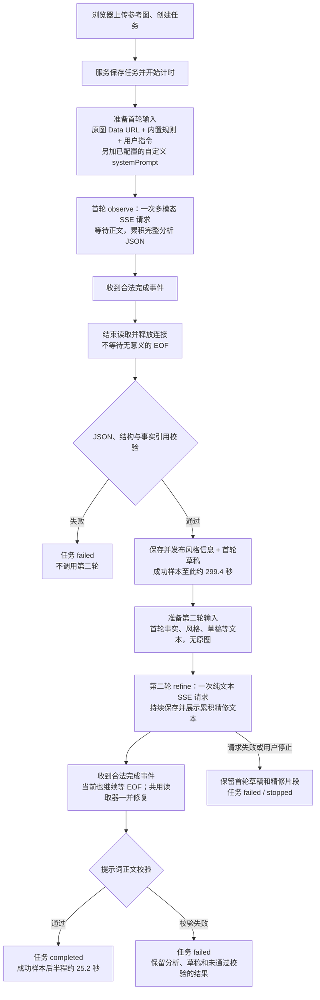

# 反推首轮耗时与结构校验修复方案

状态：**方案已实施，前端诊断待本地验收。** 服务侧已加入严格首轮 Schema、完成事件后主动收尾、渐进预览、错误码、失败阶段和分段诊断，前端现已接入安全诊断的折叠详情。严格 Schema 与首轮渐进核心链路已有用户确认；本轮未运行真实模型或部署。推理强度默认保持 `auto`。

以下内容保留最初诊断时的代码快照、耗时记录与建议，正文中“当前”指当时状态。现行接口与实施结果以 [服务器任务交接](./REVERSE_PROMPT_SERVER_TASKS.md) 和 [前端接入](./VISUAL_ANALYSIS_FRONTEND_INTEGRATION.md#前端收尾) 为准，不能用修复前的耗时推断当前速度。

## 一页评审结论

当前完整成功链路执行两次模型调用，主体、构图、风格等维度在首轮同一次请求中完成；首轮失败或用户提前停止时，第二轮不会发起：

1. **首轮 observe：一次多模态流式请求。** 请求同时携带原图、服务器系统提示词和首轮用户提示词，要求模型一次返回完整的结构化分析包。这个分析包包含分类、事实、证据、不确定项、可复用元素、风格画像和首轮反推草稿。服务在完整流结束后才做 JSON、Zod 和跨字段事实引用校验。
2. **第二轮 refine：一次纯文本流式请求。** 只发送首轮已经校验的结构化文本和草稿，不再发送原图。第二轮流式文本会持续保存并展示，结束后再做提示词正文校验。

现有“首轮约 5 分钟、第二轮约 25 秒”表示：**主要耗时集中在一次首轮多模态请求及其前后处理上**。当前首轮没有 `onText` 回调，服务会读取并累积上游正文，但不会保存或展示中间文本；完整结果返回并通过校验后，才发布风格和草稿。这些页面阶段由服务状态驱动，不代表模型分别完成了对应的视觉维度。



这里的“完成事件后等待 EOF”是当前代码路径已确认存在的等待点；它是否占了这次近 5 分钟中的主要比例，尚无分段时间证明。必须把“完成事件时间”和“响应体读取结束时间”分开记录后再判断。

### 当前能回答的分段耗时

| 环节 | 当前测量结果 | 说明 |
| --- | --- | --- |
| 浏览器上传、服务接收并创建任务 | 未测量 | 不在 `startedAt` 起算区间内 |
| 首轮准备、请求、读取、解析和校验 | 成功样本合计约 299.413 秒 | `analysis.createdAt - startedAt`；不能继续拆分 |
| 首轮请求发起到首个正文 | 未知 | 未记录请求开始和首个正文时间 |
| 首个正文到最后正文 | 未知 | 未记录正文事件时间 |
| 完成事件到 EOF | 未知 | 代码存在等待，但没有真实任务的区间数据 |
| JSON 解析、结构及引用校验 | 未知 | 当前只有阶段切换，没有独立耗时 |
| 首轮结果生成后到任务结束 | 成功样本合计约 25.206 秒 | 含首轮快照保存、第二轮请求、读取、正文校验和终态保存 |
| 任务总耗时 | 成功样本约 324.619 秒 | 从服务开始执行计算，不含浏览器上传前等待 |

这些数值来自此前只读查询的本地任务快照；本轮没有新增任务，也没有重新测量上游调用。

## 输入规模与“提示词太长”假设

当前首轮的内置文字提示词合计约 2,052 个字符，其中内置视觉规则约 1,945 个字符，首轮用户指令约 107 个字符。若用户在渠道配置中额外填写了 `systemPrompt`，它会在这两个内置片段之外继续加入请求；本地样本的 2,052 字符不包含这类自定义内容。这个数字只是字符数，不能直接换算 token；真正的 token 数还取决于分词器和渠道包装。

参考图在服务端转成 Data URL 发送，已核对样本的 Base64 约 6,594,448 个字符，Data URL 约 6,594,470 个字符。它会影响请求体大小、上传和上游视觉预处理，但不能仅凭字节数证明模型会等待 5 分钟。首轮输出约 8,500 个序列化字符、约 25 条事实，也会增加生成和解析工作量。

所以当前判断分三层：

| 判断 | 当前证据 | 结论 |
| --- | --- | --- |
| 首轮是一次请求还是多次分步请求 | `model.observe()` 只调用一次 `request()`；维度拆解在同一份结构化输出中完成 | 已确认是一次多模态流式请求 |
| 第二轮是否重复发送原图 | `model.refine()` 只发送 system + 纯文本 user message | 已确认不重复发送原图 |
| 文字过长或图片过大是否造成 5 分钟 | 当前没有首字、正文、完成事件、EOF 分段时间，也没有同配置对照组 | 尚不能归因；先补测量再优化边界 |

不要把“首轮要求同时输出很多结构字段”与“发生了多次模型调用”混为一谈。它们都会增加一次请求的输入/输出工作量，但调用次数仍然是一次。也不要在未测量前静默缩短规则、裁剪图片、降低 `reasoningEffort` 或增加重试；这些都会改变效果或成本边界，应在评审后单独决定。

## 评审时需要和其他开发结果对齐的问题

- 其他开发是否改变两轮的输入、输出或调用次数；本方案建议继续保留首轮看图产出草稿、第二轮纯文本精修。不增加独立风格调用或第三轮修 JSON。
- 分段时间只写安全服务日志，还是同时持久化到任务并开放给前端；新增快照字段的名称、可见范围和存储版本需统一确定。
- 合法完成事件中的最终正文和 usage 是否完整提取，释放响应体是否会阻塞或误用任务的停止信号；两轮共用读取器，应一并检查。
- 首轮结构化包是否继续同时承载风格信息和反推草稿；若删字段或缩短规则，哪些事实和引用校验必须保留。
- 是否允许供应商原生结构化输出；必须按实际渠道能力逐一确认，不能把 OpenAI 兼容地址都视为支持同一参数。
- 前端是否只展示安全诊断的阶段和错误码；不把上游原始响应、密钥、完整图片或完整无效输出写入快照和日志。

## 结论与证据边界

需要优先修改服务侧的首轮输出契约、流式结束处理与诊断。不能直接把长等待归因于模型自身慢，也不能靠降低推理强度或延长超时解决结构校验失败。

本地任务库中现有五条记录如下，耗时从服务器开始执行计算，不包含浏览器上传前的等待：

| 任务结果 | 总耗时 | 第一轮 | 第二轮 |
| --- | --- | --- | --- |
| completed | 约 5 分 25 秒 | 约 4 分 59 秒 | 约 25 秒 |
| failed | 约 4 分 30 秒 | 图片分析结构校验失败 | 未调用 |
| failed | 约 4 分 47 秒 | 图片分析结构校验失败 | 未调用 |
| failed | 约 5 分 06 秒 | 图片分析结构校验失败 | 未调用 |
| stopped | 约 0.9 秒 | 用户停止 | 未调用 |

成功任务的分轮耗时由 `analysis.createdAt - startedAt`、`finishedAt - analysis.createdAt` 推导，含少量校验与任务处理时间，不是独立测量的网络或模型生成耗时。现有样本表明主要时间在首轮，但尚不能区分渠道首字等待、文本输出、流关闭等待及其他处理。

这些任务的参考图均为 2336×3520、4,945,834 字节。成功分析包约 8,500 个序列化字符、25 条事实，首轮提示词草稿约 1,021 字符，最终提示词约 1,096 字符。字符不等于 token；图片大小和输出长度只是待核对变量，不能直接认定为根因。失败任务未保存首轮输出或具体校验 issue，无法还原其具体错误字段。既有任务也没有保存当次推理强度明文，不能据此断定每次实际请求都使用了默认值。

## 现有流程与旧版差异

当前链路已经是：

```text
第一轮：原图 → 完整分析 JSON → 解析与校验
        → 保存 facts、uncertainItems、reusableElements、styleProfile、reversePromptDraft
        → 发布风格信息和首轮可用草稿
第二轮：结构化分析和草稿（纯文本，无原图）→ 流式精修 → 替换提示词
```

`server/reverse-prompt/routes.mjs` 已在第一轮校验通过后立即保存并发布分析与草稿，再启动第二轮。前端从 `task.prompt.modelText` 读取内容。因此，“首轮完成后立即展示草稿”已经实现，应保留并验收，不是本次需要新增的能力。首轮未返回完整且合法的 JSON 时，不能把半截 JSON 当作可用草稿展示。

旧 `web/src/services/api/reverse-prompt.ts` 是一轮直接生成自然语言提示词，没有这份完整分析包及其跨字段校验。当前首轮要求同一视觉内容出现在事实、证据、风格、六组草稿字段及完整草稿正文中，工作量和输出要求已经改变。这是需要优化的流程差异，但没有旧版同图、同配置的耗时记录，暂不能量化其影响。

浏览器内置 OpenAI 请求与当前服务器请求均使用 Responses 流式接口，`auto` 均省略显式推理强度参数；没有源码依据认为本轮改成了另一种 OpenAI 协议。执行环境则从浏览器变为 Node 直连公开渠道，不使用浏览器本地代理或自定义脚本。对比旧版速度时须核对模型、渠道、系统提示词及网络路径是否一致。

## 建议修改（待评审）

建议先补齐错误分类和分段测量，让后续结果可以解释；同时修复已确认的流结束处理和非法示例。首轮文字去重先保留现有字段和语义，在同图、同模型、同渠道的验证设计中单独评估。这样既能处理确定的问题，也能判断剩余耗时来自哪一段。

### P0：拆开失败类型，保留安全诊断

当前 `parseObservation` 把 `JSON.parse`、Zod 字段校验和 `superRefine` 引用校验的异常全部转换成“图片分析结构不合格，请手动重新分析”。这条报错说明已走到首轮解析或校验，不是页面超时或 SSE 断开错误，但无法继续定位原因。

拆分为三类明确错误，名称可按项目约定调整：

| 错误码建议 | 含义 | 必须记录的安全信息 |
| --- | --- | --- |
| `OBSERVATION_JSON_INVALID` | 首轮不是合法 JSON | 失败环节、输出字符数、是否收到合法流完成事件 |
| `OBSERVATION_SCHEMA_INVALID` | 字段、类型、枚举或额外字段不符合契约 | issue 类型、字段路径、预期结构；不包含实际字段内容 |
| `OBSERVATION_REFERENCE_INVALID` | 缺必需维度、重复 ID、不存在的引用或引用状态错误 | 规则类别和准确字段路径；不包含事实描述或实际 ID 值 |

服务保持简洁中文错误文案；开发诊断应能定位如 `reversePromptDraft.factIds`、`facts` 的问题，而不是只得到一句泛化错误。利用现有 Zod issue，给语义规则添加机器可判别的类别，不通过匹配中文报错文字来判断错误类型。继续验证事实 ID 唯一性、引用存在性和 observed/uncertain 语义，不通过填空或编造事实把坏结果改成通过。

`finish()` 当前对所有终态统一写 `stage = completed`，不能靠最终 stage 判断失败发生在哪一步。进入终态前记录独立 `failureStage`，保留 `status = failed/stopped/interrupted` 的真实含义。

常规日志只记录任务归属所需标识、错误码、字段路径、时长与数量等安全元数据，不输出 Key、完整请求、原图、完整模型输出、提示词正文或上游原始错误正文。无效分析不作为正常结果发布；第二轮失败时仍保留已校验的首轮草稿和精修片段。

### P0：按合法完成事件结束模型流，不依赖连接关闭

当前 `readModelStream` 收到 OpenAI `response.completed` 或 Gemini `finishReason = STOP` 后只设置 `complete`，外层仍遍历响应 body 直到 EOF，再返回首轮文本。若渠道发出完成事件后保持流连接，后续解析及草稿发布仍会等连接关闭。旧浏览器读取器也等待 EOF，因此这不是已证实的“从浏览器迁移到服务端”回归原因，但服务侧应消除这类额外等待。

修改要求：

- 处理合法的完整完成事件，保留该事件中的最终文本与 usage，然后结束本轮读取并释放连接。
- 不把单条 `output_text.done`、`[DONE]`、任意半截 JSON 或一个可解析的对象当作完整成功。模型失败、拒绝、不完整和 EOF 前缺少合法完成标志仍按失败处理。
- 正常完成后的连接释放不能被误记成用户停止或模型中断；明确 stop 仍中止对应任务。
- 复用现有 `eventsource-parser` 与流读取能力，不手写另一套 SSE 解析器。

目前没有完成事件与 EOF 的分别时间，不能声称这就是本次近五分钟的原因。修改后用假流模拟“已完成但连接未关闭”即可验证，无需付费模型调用，也不需要新增生产超时值。

### P0：对齐首轮规则示例与运行时校验，减少重复输出

`shared/visual-analysis-rules.mjs` 的 JSON 示例目前将枚举写成 `"observed|uncertain"`、`"photography|illustration|..."`、`"preserve|replace"`。这些是枚举说明，不是合法单一取值；模型照抄就会被当前 schema 拒绝。尚无失败原文，不能认定这次一定是枚举照抄，但应消除该诱因。

修改要求：

- 将“允许值清单”和“合法 JSON 示例”分开；示例中每个枚举只填写一个有效值，全部 ID 引用互相成立。
- 明确摄影图必须有 viewpoint/lighting，人物及封面等分类必须有对应维度，使提示规则与 `superRefine` 要求一致。无可辨文字时明确记录无可辨文字，不猜造文字内容。
- 事实只描述一个可核对要点，证据只解释可见依据；风格字段简洁摘录，六组 sections 不重写长分析，完整草稿保留关键主体关系、构图、光色、材质和版面细节。
- 不静默删除现有字段，不裁掉必要事实，不添加 facts 数量、字数、token、图片大小或时长硬上限。需要改变这些行为边界时单独说明默认值、适用环节及失败方式，再取得用户确认。
- 规则内容改变时同步规则版本、服务身份绑定和浏览器公共服务的契约说明，避免文档或缓存仍标识为旧规则。

第二轮保持纯文本精修，不再发原图，不生成独立风格模板，不新增自动第三轮“修 JSON”或付费重试。首轮结果未合法时不启动第二轮；首轮合法时继续立即发布草稿和风格信息。

### 已实施：补上分段耗时，定位真正的等待位置

每轮记录以下时点或耗时，并使用同一进程的单调时钟计算区间：

| 指标 | 用途 |
| --- | --- |
| 模型请求开始、收到响应头 | 区分连接/渠道响应等待 |
| 首个有效正文文本、最后正文文本 | 区分首字等待和正文输出时间；不把思考或心跳当正文 |
| 合法完成事件、响应读取结束、结束方式 | 识别“已经完成但仍等待连接关闭”；结束方式区分完成事件、自然 EOF、停止和错误 |
| JSON 解析、结构校验、引用校验耗时 | 排除程序校验环节的异常耗时 |
| 草稿快照保存并发布、第二轮开始 | 核对两轮衔接是否存在空转 |
| 请求轮次、输出字符数、供应商 usage | 明确一次还是两次调用、输出及消耗；usage 缺失留空，不估算 |

同时记录安全的配置标识和本次 `reasoningEffort`，便于同图、同模型、同渠道比较；`auto` 保持当前省略显式推理参数的行为，不强制写成 `low`。区分实际调用次数与用户重试次数，不把刷新、SSE 重连或历史查询计为模型调用。

修复后正常路径可能不再读到自然 EOF，不能把连接取消或读取器释放的时间标成 EOF。应分别记录完成事件、本轮读取结束和实际结束方式；缺失的事件时间留空。响应头到达不等于图片上传完成或视觉处理完成，首个正文前的时间也可能包含上游排队和推理，因此这些指标能定位等待区间，不能直接拆出供应商内部阶段。

优先以安全服务诊断落地。若还要让刷新后的任务详情或前端显示 `diagnostics`/`metrics`，需同步服务器快照、SQLite 保存、接口文档与 `web/src/services/api/reverse-prompt-tasks.ts` 的 Zod schema；当前前端默认解析会移除未声明字段，不能只加服务字段就认为页面已经接入。数据结构调整须说明版本和现有历史处理，沿用未知版本拒绝覆盖的保护，不清空历史来掩盖升级问题。

### P1 可选：使用渠道原生结构化输出

确认实际模型与渠道支持后，再决定首轮是否使用供应商原生结构化输出，提高 JSON 字段与枚举的稳定性。参数与能力按实际供应商契约核对，不默认所有 OpenAI 兼容渠道都有相同支持。

schema 从现有契约与成熟库生成或统一管理，不手写另一份容易漂移的规则。供应商结构约束不能代替事实 ID 和跨字段语义校验。渠道不支持时明确提示配置问题，不能自动再发一次付费请求做降级。

## 前端接入范围

本次主要修复在服务侧。前端保持提示词在上、风格信息在下，facts、不确定项和可复用元素在折叠的“查看分析详情”中；风格信息仍来自首轮，不独立调用模型。

全局 store、服务器持久任务、历史查看与活动任务的区别、刷新恢复、停止操作、累计计时和真实阶段标题继续沿用。等待说明不冒充模型已经完成某个分析维度。

如果服务增加安全错误码、失败阶段或阶段耗时字段，前端按新快照契约接入后再展示；无需为本次修改重做页面布局或新增任务页签。服务开发交付时同时给出字段定义与假模型回归结果。

## 验收与实施边界

服务侧已完成不付费的契约与假流回归；后续验收仍需覆盖：

1. 合法分析可通过；每个分类的必需维度与规则示例均满足校验。
2. 无效 JSON、字段缺失、错误类型/枚举、额外字段、重复 ID、缺维度、错误引用分别输出可定位的安全诊断。
3. 合法完成事件后，即使上游继续保持连接也能结束本轮；只有文本结束但无完整完成事件不能报成功。
4. 首轮校验成功即保存与发布风格和草稿，再发第二轮纯文本请求；累计最多两轮，不自动修复重发。
5. 第二轮流式内容整体替换，失败或停止保留首轮草稿及 partialText，不伪装 completed。
6. 快照刷新恢复仍有效；新增诊断不泄露密钥或内容，停止与幂等不会造成重复模型调用。

真实模型验证另行获得用户授权，并先确认同图、同模型、同渠道、`auto` 的对比设计。修改前后的记录都应分开报告首字等待、正文输出、完成事件到读取结束及校验耗时；没有授权不发送新的模型请求，不自动重试。不承诺固定秒数，以数据判断哪一段得到改善。

本轮没有调整模型推理强度、请求轮数、超时、图片缩放、并发上限或历史数据，没有运行构建、类型检查或模型验收。

## 实施文件

| 文件 | 修改职责 |
| --- | --- |
| `server/reverse-prompt/model.mjs` | 解析与校验错误分类、合法流完成处理、分轮测量 |
| `server/reverse-prompt/routes.mjs` | 保存失败环节、安全诊断、首轮草稿发布与二轮衔接 |
| `shared/visual-analysis-rules.mjs` | 合法示例、枚举及必需维度说明、减少重复表达 |
| `server/reverse-prompt/storage.mjs` | 如需持久诊断则同步保存与存储版本，否则不改 |
| `web/src/services/api/reverse-prompt-tasks.ts` | 如新增快照字段，显式声明并校验 |
| `docs/hitflare/REVERSE_PROMPT_SERVER_TASKS.md` | 更新实际交付的错误与快照契约 |
| `docs/hitflare/VISUAL_ANALYSIS_FRONTEND_INTEGRATION.md` | 同步规则与前端接入说明 |

现有创建、查询、订阅、停止和重试接口可继续使用。先综合其他开发改动，确定错误、分段时间、规则和快照契约，再形成最终实施清单；本方案不重做整套任务服务。
