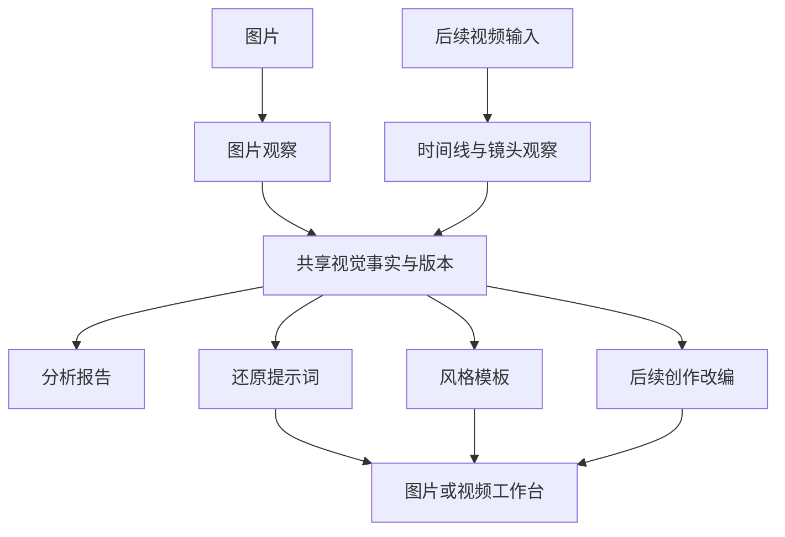

# HitFlare 视觉拆解与反推提示词升级方案

> 状态：图片视觉分析服务已实现；前端页面接入、真实模型联调和用户验收待完成。本文继续作为后续开发依据。
>
> 第一阶段：升级现有「反推提示词」图片功能，增加场景拆解、共享视觉事实、还原提示词和风格提取。
>
> 后续阶段：接入视频观察与逐镜提示词，再扩展创作改编、平台适配和生成结果对比。

## 1. 产品定位与现有基线

目标是让用户理解参考素材的视觉做法，并把分析转成可用于创作的提示词或模板。分析拆解本身就是可使用的结果，不要求用户一定生成提示词。

现有页面基线见 `web/src/services/api/reverse-prompt.ts`、`web/src/pages/reverse-prompt/index.tsx` 和 `web/src/services/reverse-prompt-storage.ts`：单张图片与指令通过 `requestImageQuestion` 请求视觉文本模型，流式输出中文文本；前端正在同步调整为单图反推。新的独立服务见 `web/src/services/api/visual-analysis.ts`、`web/src/services/visual-analysis/`，页面接入说明见 `VISUAL_ANALYSIS_FRONTEND_INTEGRATION.md`。

首版功能与验收记录见 [反推提示词菜单功能方案](REVERSE_PROMPT_FEATURE_PLAN.md)。本文规定后续升级；与首版关于“只输出最终提示词”的要求冲突时，升级采用本文的“分析与提示词分别交付”，可复制提示词仍不夹带分析说明。

不声称恢复作者唯一的原始 Prompt、模型、seed 或不可见参数。多阶段调用是否提高生成相似度，需要实际对照；结构更完整不等于视觉判断更准确。

## 2. 三个开源方案的组合

| 参考项目 | 已研究的实现 | HitFlare 采用的机制 |
| --- | --- | --- |
| image-prompt-reverse | Agent Skill；按场景拆维，提供还原、增强、变体和平台输出；没有固定 API 编排 | 按题材、媒介和版面选择维度，分开事实分析与创作输出 |
| MX-Insight | 图片浏览器扩展；标准模式单次视觉调用，高级模式实际执行分类、深度分析、生成、精修四次调用 | 分阶段请求、结构化中间结果、阶段状态和有效结果保留 |
| minimax-h3-video-reverse-skill | 视频反推 Skill；事实绑定证据，再编译不同形式并校验 | 区分事实、未知和改编，派生结果绑定事实版本；视频增加时间与证据约束 |

采用机制组合，不嵌入三个项目或新增通用 Agent 编排框架。图片首期用短小直接的服务函数完成流程。

## 3. 图片与视频的共用边界

图片与视频共用主体、外观、环境、构图、光线、色彩、材质、文字和风格分析。输入观察过程分别实现：图片观察静态画面；视频观察时间线、真实切镜、动作、运镜、终态，以及实际可核实的声音。

| 部分 | 图片首期 | 后续视频 |
| --- | --- | --- |
| 输入 | 一张图片 | 原生视频输入，或带时间戳的多帧/片段观察 |
| 共用事实 | 主体、空间、构图、光色、材质、文字、风格 | 每镜共享视觉锚点和画面事实 |
| 扩展事实 | 场景相关细节 | 时间范围、动作顺序、运动来源、转场、结束状态、音频 |
| 输出 | 分析报告、还原提示词、风格模板 | 镜头分析、逐镜首帧与 Motion Prompt、装配说明 |
| 能力确认 | 所选接口能接受图片 | 单独确认视频、连续视觉内容和音频能力 |

支持图片输入不等于支持 MP4 或音频。稀疏截图只能覆盖实际观察到的部分，不能冒充完整视频。图片首期不显示尚不可用的视频任务入口，不增加抽帧、转写或视频模型调用。

## 4. 第一阶段的产品范围

沿用「反推提示词」菜单、`/reverse-prompt` 路由及创作灵感之后的位置。保留单图上传、拖放、区域内粘贴、现有渠道和模型选择、停止、复制、当前与上次结果、按用户恢复本地数据。

页面提供三个同级任务，默认沿用当前风格提取用途：

| 任务 | 用户目标 | 交付 |
| --- | --- | --- |
| 分析拆解 | 看懂画面如何组织及哪些要素可复用 | 结构化分析、关键特征、可复用要素与不确定项 |
| 还原提示词 | 描述并重建参考图的可见内容 | 完整中文提示词；对应原「文生图模仿」用途 |
| 风格提取 | 保留视觉语言并替换主体 | 中文风格模板；对应原「图生图通用仿照」用途 |

分析结果应能单独复制。最终提示词可编辑、完整复制；用户的提示词编辑保存为单独草稿，不反向冒充图片事实。

首期不包含视频、批量图片、自动出图、创意增强、多个变体、平台专属参数、完整历史库、Agent/画布联动或独立 OCR 服务。后续“用于图片创作”的交接遵循现有工作台模式：带入提示词与用户选择的参考图，生成参数由工作台处理；不把自动出图混入分析。

## 5. 分类与场景分析维度

分类由三个可组合的轴组成，允许未知或混合，不推断原始模型与具体作品来源：

- 表现媒介：摄影、插画、3D、平面设计、混合或未知。
- 主要题材：人物、产品、美食、建筑室内、风景、动物、汽车等，可多选。
- 版面形式：普通画面、海报广告、封面、Logo/字标、界面截图等，可多选。

例如护肤品广告可以同时为“摄影 + 产品 + 广告海报”，组合产品、摄影和版面维度，避免单一分类遗漏文字布局。分类在首次视觉观察中完成，不单独增加一次请求。

| 维度组 | 需要观察的内容 |
| --- | --- |
| 通用 | 主体数量与外观、前中后景、位置关系、比例、构图、景别与视角、留白、光线方向与软硬、配色、材质、媒介、氛围 |
| 人物 | 姿态、表情、视线、服装结构、配饰、头发、人物之间的关系、可见皮肤与布料质感 |
| 产品 | 外形与部件、画面占比、拍摄角度、材质与表面、反光、背景过渡、接触阴影 |
| 美食 | 食物形态、可见蒸汽与光泽、视角、餐具、摆盘、食材质感；不凭常识补配料 |
| 建筑/室内 | 空间层次、透视、线条、材质、门窗及物件位置、自然光与人工光 |
| 风景 | 前中远景、地平线、天气和大气、光线、空间纵深；不猜具体地名 |
| 插画/3D | 线条与笔触、着色方式、几何、材质表现、阴影、渲染观感；不猜软件或引擎 |
| 海报/封面/Logo/界面 | 字形观感、可辨文字、文字层级、位置、图文重叠、网格、边距、视觉焦点 |

第一阶段报告覆盖画面结构、风格、适用的摄影/设计细节，以及可复用要素。单图叙事只描述可见表达，不编造前后剧情。暂不增加“商业效果评分”或无法核实的营销因果。

## 6. 共享视觉事实与输出契约

采用一份简洁的结构化分析作为源头，避免分析报告、还原 Prompt 和风格模板各自重新猜图。

| 分组 | 建议字段 | 约束 |
| --- | --- | --- |
| 归属与版本 | analysisId、sourceId、revision、分析模型标识、分析规则版本 | 同一结果可追溯到本次输入和分析；用户归属由程序设置 |
| 分类 | medium、subjects、layoutTypes | 可组合，无法确认时标未知 |
| 分析摘要 | summary | 概括画面及关键视觉特征 |
| 事实列表 | facts：id、dimension、description、status、evidence | dimension 表达所属维度；每条事实保留稳定 ID |
| 缺口 | uncertainItems | 存放不可辨文字、遮挡和无法确认的细节 |
| 可复用要素 | reusableElements | 明确应保留特征与可替换项，引用相关事实 ID |
| 派生输出 | task、text、analysisId、analysisRevision、生成模型及规则版本、状态 | 模型输出与用户编辑稿分开保存 |

事实状态区分 `observed`（模型依据可见画面作出的观察）、`uncertain`（无法确认）、`user_requested`（用户要求的内容或改编）。`observed` 不代表人工审核通过。

图片证据先绑定输入图片与可见位置说明，如“主体右侧边缘”“左上标题区”；不要求模型虚构精确坐标，也不把文字说明当成独立检测证据。视频后续再引入帧、片段、音频与时间范围。

观察可写“浅景深、背景柔和虚化”；不能据此认定镜头品牌、焦段、光圈、相机型号。分析解释或建议放在报告中，不以确定事实身份进入还原提示词。

允许用户在对应分析条目做轻量文字修正并保留模型原稿。用户修正必须记录来源：确认画面事实的纠错与要求新增内容的改编分开；未经原图核实的修改不能自动标成模型已观察。

输入图片改变后使用新 sourceId 和 analysisId。事实修正使 revision 更新，旧提示词保留但标为待更新；用户明确点击后才根据新事实重新生成。最终提示词编辑不改变事实 revision。

## 7. 提示词生成规则

### 7.1 还原提示词

按主体与动作、细节、环境与空间、构图、光色、材质、媒介及氛围组织自然中文。保留可辨文字并用引号引用；不可辨文字不补全。无主体替换占位符，无默认电影感或“惊艳增强”，不包含分析标题、事实 ID 或校验说明。

优先保留有辨识度的具体画面关系，避免“8K、masterpiece、极致细节”等通用词代替观察。精确像素宽高和原图比例来自程序解码的图片信息，不由模型猜测；生图尺寸仍由工作台设置。

### 7.2 风格提取

保留构图、层次、光色、材质、媒介、留白及氛围。去除具体人物/角色身份、地名、原图实际文案和特定故事；主体使用且只使用一次 `[在此处替换为您想要生成的主体内容]`。模板不自动美化成另一种风格。

### 7.3 不确定性与改编

不确定项可在分析报告展示，不能作为确定事实写入还原 Prompt。用户要求新增的元素标记为改编，不能覆盖源观察；首期不做独立创意增强流程。

输出默认中文，不一次生成四种语言，也不要求用户填写平台、风格方向和用途问卷。第一阶段没有平台参数与负向字段的统一假设；后续按实际生图接口适配。

## 8. 请求流程、复用与失败处理

采用“观察 → 生成”两步设计，不固定执行三次或四次调用，也不新增“顶级模式”承诺。

1. **观察**：图片、分类/维度规则 → 一次视觉请求 → 完整 JSON 解析与校验 → 保存有效分析。
2. **生成**：原图、有效分析、选定任务 → 一次请求 → 流式中文提示词 → 校验后保存。

只选“分析拆解”时，完成观察即可。首次选“还原提示词”或“风格提取”时，明确提示会先分析、再生成，正常路径包含两次模型请求。切换任务页签只切换展示，不自动请求；用户点击生成且已有当前图片的有效分析时，复用它，仅执行生成步骤。

改变分析模型或分析规则、重新分析、替换图片时，不复用旧分析；这些操作不自动请求。修正分析后可基于新 revision 生成，不必把所有内容重新看一遍。用户能区分“重新分析图片”和“根据已有分析生成提示词”。

分析 JSON 在完整解析前不进入权威事实；过程显示“正在分析图片/整理分析”。最终提示词可以流式显示，完整结构化报告无需逐 token 拼装。界面只显示实际阶段，不使用估算百分比冒充完成进度。

| 情形 | 处理 |
| --- | --- |
| 图片读取或模型配置失败 | 显示具体原因，保留已有有效结果 |
| 分析请求或 JSON 校验失败 | 标记分析失败，不继续生成；用户可手动重新分析 |
| 生成失败或用户停止 | 保留分析和部分提示词，标记未完成；允许手动重新生成 |
| 完整文本违反占位符等规则 | 保留为待修正草稿，不标记合格完成，允许用户修改或手动重生成 |
| 刷新、离开或切换账号 | 取消活动请求；恢复中断状态，不自动续接或重复请求 |
| 图片/版本/用户归属与回调不一致 | 丢弃过期回调，不能覆盖新任务结果 |

第一阶段沿用现有无自动重试的行为，失败不静默降级到另一条模型流程。专项复核与额外付费请求属于后续优化，由明确动作触发；不在本期自动加入 OCR、裁图复核或多模型评审。

超时、图片大小、并发、输出上限等沿用当前项目与渠道行为。需要改变边界值时，先明确适用环节、默认值与失败处理，再取得确认；本文不设新增经验阈值。

## 9. 页面、存储与代码落点

沿用图片工作台视觉：顶部同级任务 Tab；桌面左侧输入与模型、中间分析/提示词、右侧最近结果，窄屏按可用空间调整。白色主体、黑色正文、细分隔线，16px 标题与 13px 正文；主题和弹层沿用全局配置。

分析报告按维度分组，关键特征、可复用要素和不确定项独立可读。长文字使用明确展开与滚动，复制完整文本。切换 Tab 不篡改已保存结果的任务、模型或来源标签。

- `web/src/pages/reverse-prompt/`：任务入口、报告展示、轻量修正、提示词输出和实际阶段状态。私有组件及 hook 保留在本目录。
- `web/src/services/api/visual-analysis.ts`：图片解码、观察、结构化校验、提示词编译、阶段事件、运行/账号归属和分析复用；复用 `requestImageQuestion`、模型配置及现有协议适配，不写死第三方端点。
- `web/src/services/visual-analysis/contract.ts`、`rules.ts`：场景维度、Zod 结构契约、事实引用、版本、纠错、提示词占位符校验和独立提示词规则。
- `web/src/services/visual-analysis/storage.ts`：按当前用户保存图片源、分析版本、输出及当前/上次结果；使用 localforage，不保存到 localStorage。
- `docs/hitflare/VISUAL_ANALYSIS_FRONTEND_INTEGRATION.md`：前端页面的导入、调用、事件、错误、复用、修正和恢复契约。
- 现有文案文件：新增任务、阶段、缺口和失败文案。

结构调整直接采用新设计，不加入旧字段兼容、迁移兜底或静默清空历史的逻辑。业务结果保存与请求归属必须绑定当前用户、当前运行及输入版本；API Key 继续使用当前浏览器配置，图片由前端发往用户所选渠道。

本期只保留当前/上次两个分析结果包，不增加云同步或后台续跑。结果包绑定自身图片来源与名称，不能因为用户替换输入而把旧报告解释成新图片的分析。

## 10. 第一阶段验收

| 样例或操作 | 验收重点 |
| --- | --- |
| 人像 | 姿态、视线、服装、景别、光线和背景关系准确，不填不可见相机参数 |
| 产品广告 | 同时采用产品、摄影与海报维度，包含材质、占比、文字层级和留白 |
| 美食 | 可见质感与摆盘，不编造蒸汽、食材或品牌 |
| 室内与风景 | 空间层次、透视、前中远景与光线，不猜地名 |
| 插画与 3D | 使用对应媒介词汇，不强行套真实摄影设备 |
| 模糊文字与遮挡 | 不确定项明确，最终提示词不补写缺失内容 |
| 三个任务 | 分析可独立交付；还原保留内容；风格模板只出现一次主体占位符 |
| 同图切换任务 | 展示切换不请求，手动生成复用有效事实；分析和输出来源可追溯 |
| 分析修正 | revision 更新，旧派生文本提示待更新，重新生成依据修正结果 |
| 失败与停止 | 有效分析不丢失，部分文本标未完成，没有隐藏重试或自动出图 |
| 快速换图/账号切换 | 旧回调不能污染新任务；账号数据隔离 |
| 刷新恢复 | 保存的结果可读，中断状态准确，不自动重复付费请求 |
| 桌面与主题 | 1440×900、1920×1080、Agent 占用空间、浅深主题与窄屏，长文与控件可用 |

结构校验检查 JSON、必填字段、ID 引用、状态、输入与版本归属、占位符数量。语义复核检查是否忠于画面、是否漏掉关键细节，以及是否把推测写成事实；不能通过 JSON 合格或关键词匹配证明视觉准确。

生成效果验证单独开展：用相同参考图、同一生图模型、同一参数和参考图使用方式比较首版与升级版提示词，记录最终提示词、分析规则版本、实际请求及人工观察。未经此验证，不宣称相似度、速度或准确率提升。付费验证另行确定执行范围，不自动批量测试。

## 11. 后续阶段

第二阶段接入视频观察：先核实用户渠道能力，再实现时间线、真实切镜、动作/运镜、首尾状态、不确定项和音频边界；从共享事实输出逐镜首帧与 Motion Prompt，分别对接实际支持的目标平台。

第三阶段增加用户主动触发的创意增强、单维度变体、平台适配、工作台交接及参考/生成结果对比。平台能力、模型版本和参数以实际接口为准，不把 H3 或旧 MJ/Flux 示例当成通用协议。

服务开发完成后，把图片升级事项从 TODO 移到 Pending Tests，并在 CHANGELOG 的 Unreleased 记录实际用户可感知变化。页面接入和用户验收通过后再更新正式 Features，不能把本方案当作已完整交付功能。

## 12. 来源与证据边界

开源结论来自此前固定提交的源码研究，本次记录没有重新拉取上游；机制可参考，效果未做独立对照验证。

- [image-prompt-reverse 的工作流](https://github.com/luozhilzh/image-prompt-reverse/blob/ef7b9aa38268c0258c5ecf6ff6ba551b57205516/SKILL.md)、[分析骨架](https://github.com/luozhilzh/image-prompt-reverse/blob/ef7b9aa38268c0258c5ecf6ff6ba551b57205516/assets/analysis-form.md)：MIT；场景维度与输出方法可参考，默认“惊艳增强”不作为保真模式。
- [MX-Insight 的实际请求编排](https://github.com/Maishan-Inc/MX-Insight/blob/bb062578237250cc65282db079d67d38f27aa80d/background.js#L1215)：研究提交未发现 LICENSE/COPYING，只有版权声明；依据行为契约独立实现，不复制代码或模板。
- [H3 视频反推工作流](https://github.com/gnipbao/minimax-h3-video-reverse-skill/blob/d17fc821dad9b8e48fb07396d1abb7a8ba1d594c/SKILL.md)、[事实契约](https://github.com/gnipbao/minimax-h3-video-reverse-skill/blob/d17fc821dad9b8e48fb07396d1abb7a8ba1d594c/references/evidence-contract.md)：MIT；编译与校验能验证契约一致性，不能替代真实观看和生成效果验证。

本文记录组合与图片优先范围。图片服务接口已经实现，但没有执行真实模型调用或部署；页面接入和视觉效果仍需单独验收。
